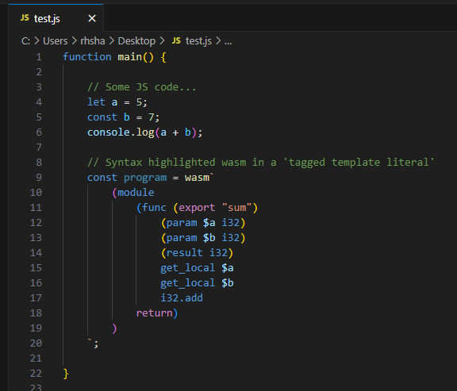

# VS Code JavaScript Tagged Template Literal String Grammar Injection for Web Assembly

Highlight Web Assembly code inside JS Tagged Template Literal Strings.

# Resources

https://github.com/mjbvz/vscode-js-template-string-grammar-injection-example/tree/master

https://github.com/jcmellado/vscode-wasm-syntax-lite
